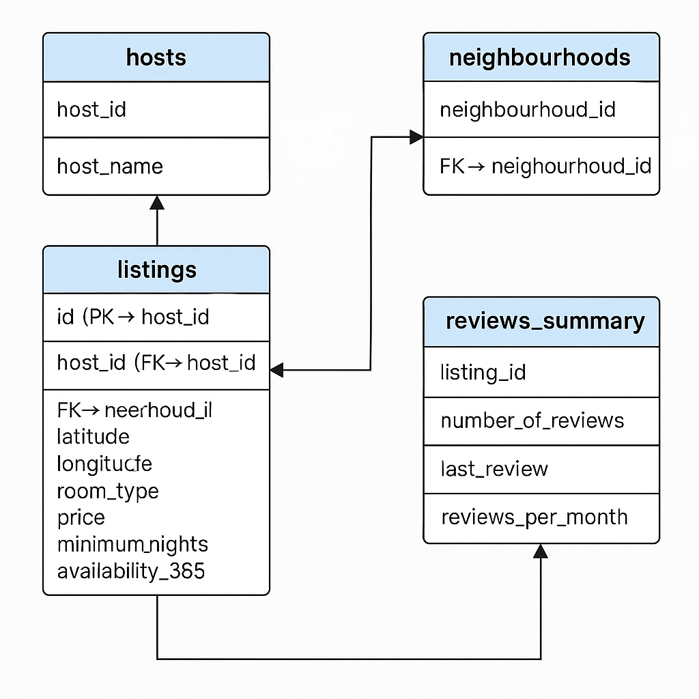

# 🏡 Airbnb Data Analysis & Dashboard Project

This project explores Airbnb listing data through a complete data analytics workflow: **data modeling**, **SQL analysis**, and **Power BI dashboarding**. The goal is to extract actionable insights using real-world data in a professional, relational setup.

---

## 📦 Dataset

The dataset was sourced from [Inside Airbnb](http://insideairbnb.com/get-the-data.html), containing detailed listing information including:

- Listing info (ID, name, price, availability, location)
- Host info
- Room types
- Reviews and ratings
- Neighborhood metadata

---

## 🧱 Data Modeling in PostgreSQL

### ✅ Why Normalize?

The original CSV was a wide, denormalized flat file. We normalized it into relational tables to enable:

- Efficient querying with JOINs
- Reduced redundancy
- Clearer relationships between entities

### 🗂️ Final Database Schema

```
hosts (host_id PK, host_name)

neighbourhoods (neighbourhood_id PK, neighbourhood_cleansed, neighbourhood_group_cleansed)

listings (
    id PK,
    name,
    host_id FK → hosts.host_id,
    neighbourhood_id FK → neighbourhoods.neighbourhood_id,
    latitude,
    longitude,
    room_type,
    price,
    minimum_nights,
    availability_365
)

reviews_summary (
    listing_id PK FK → listings.id,
    number_of_reviews,
    last_review,
    reviews_per_month
)
```



---

## 🧠 SQL Analysis

Using PostgreSQL, we performed analysis across normalized tables to answer real-world business questions.

### 📊 Sample Analyses:
- Total number of listings
- Top neighborhoods by estimated revenue (`price * availability_365`)
- Average price and availability by room type
- Hosts with the most listings
- Listings with no reviews or suspicious minimum nights
- Fully available listings (`availability_365 = 365`)
- Revenue analysis by host and neighborhood

SQL techniques used:
- JOINs
- Aggregations (`SUM`, `AVG`, `COUNT`)
- Window functions

---

## 📈 Power BI Dashboard

We connected Power BI directly to the PostgreSQL database using custom SQL queries and table relationships. The dashboard showcases:

### 🎯 KPIs:
- Total Listings
- Total Estimated Revenue
- Average Price
- Average Reviews per Month

### 📊 Visuals:
- **Bar Chart**: Top 10 neighborhoods by revenue
- **Stacked Bar**: Room type distribution per neighborhood group
- **Treemap**: Top hosts by listing count
- **Map**: Listings by price (latitude, longitude)
- **Scatter Plot**: Price vs number of reviews
- **Line Chart**: Trends in reviews per month (if extended)

### 🧰 Slicers:
- Neighborhood Group
- Room Type
- Price Range
- Availability Range

---

## 🛠️ Tech Stack

- **Python (Pandas + SQLAlchemy)**: Data loading & transformation
- **PostgreSQL**: Data modeling & SQL queries
- **Power BI**: Visualization & dashboarding

---

## 📌 Author

*Avas Bajracharya*  
Graduate Student | Data Analytics Enthusiast  
[LinkedIn Profile](https://www.linkedin.com/in/avas-bajracharya-640357200/) | [Portfolio Website](https://www.avasbajracharya.com.np/)

---

## ✅ Key Takeaways

- End-to-end analytics workflow using real-world data
- Strong SQL data modeling and query skills
- Interactive dashboard with business insights
